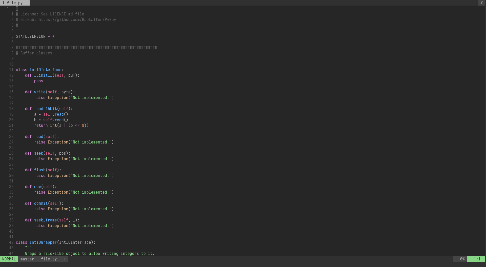
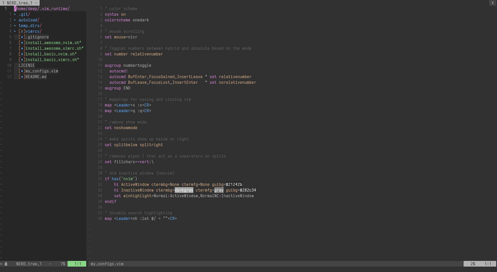

# Vimrc

This is built upon https://github.com/amix/vimrc so, if you want to use that instead, please go to that link!
This fork customizes original configurations to my needs:

There are two versions:

* **The Basic**: If you want something small just copy [basic.vim](https://github.com/dhillondeep/vimrc/blob/master/vimrcs/basic.vim) into your ~/.vimrc and you will have a good basic setup
* **The Awesome**: Includes a ton of useful plugins, color schemes, and configurations

I would, of course, recommend using the awesome version.

## How to install the Awesome version?
The awesome version includes a lot of great plugins, configurations and color schemes that make Vim a lot better. To install it simply do following from your terminal:

	git clone --depth=1 https://github.com/dhillondeep/vimrc.git ~/.vim_runtime

    # vim users
	sh ~/.vim_runtime/install_awesome_vimrc.sh

    # neovim users
    sh ~/.vim_runtime/install_awesome_nvim.sh

## How to install the Basic version?

The basic version is useful to install on remote servers where you don't need many plugins, and you don't do many edits.

	git clone --depth=1 https://github.com/dhillondeep/vimrc.git ~/.vim_runtime

    # vim users
	sh ~/.vim_runtime/install_basic_vimrc.sh

    # nvim_users
    sh ~/.vim_runtime/install_basic_vimrc.sh

## How to install on Windows?

Use [gitforwindows](http://gitforwindows.org/) to checkout the repository and run the installation instructions above. No special instructions needed ;-)

## How to install on Linux

If you have vim aliased as `vi` instead of `vim`, make sure to either alias it: `alias vi=vim`. Otherwise, `apt-get install vim`

## How to update to latest version?

Just do a git rebase!

    cd ~/.vim_runtime
    git pull --rebase

## Some screenshots

Colors when editing a Python file:

[NERD Tree](https://github.com/scrooloose/nerdtree) plugin in a terminal window:

## How to include your own stuff?

- For configurations, you can modify **~/.vim_runtime/my_configs.vim** to fill in any configurations that are important for you. 
- For plugins, you can modify **~/.vim_runtime/vimrcs/plugins_config.vim**!

## Key Mappings

The [leader](http://learnvimscriptthehardway.stevelosh.com/chapters/06.html#leader) is `,`, so whenever you see `<leader>` it means `,`.

## How to uninstall
Just do following:
* Remove `~/.vim_runtime`
* Remove any lines that reference `.vim_runtime` in your `~/.vimrc`
